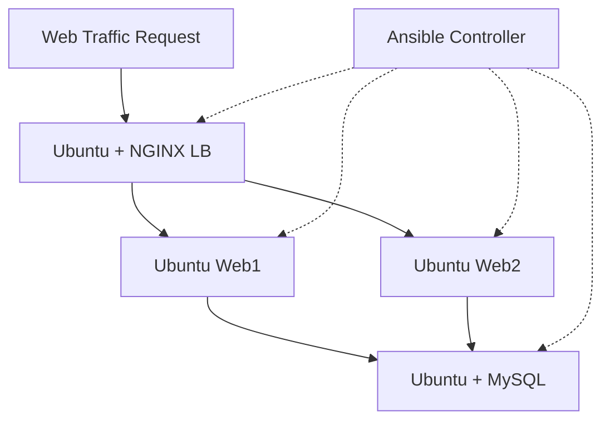

# About Ansible-lab (Configuring Flask Web App) 
This lab environment consists of four Ubuntu-based containers, each operating as a lightweight virtual machine within an isolated containerized infrastructure. Two containers are configured as web servers, while the remaining containers provide MySQL database and load-balancing services. The host machine will be acting as Ansible controller. 

Ubuntu container images were intentionally selected instead of prebuilt MySQL or Nginx images to demonstrate infrastructure configuration and service deployment through Ansible automation. This approach highlights configuration management, software provisioning, and orchestration practices commonly used in cloud and DevOps environments, rather than relying on vendor-preconfigured application containers.

Containers were chosen to reduce system resource consumption, improve deployment speed, and enable rapid environment provisioning and teardown. The overall objective of this lab is to provide a practical demonstration of Ansible automation workflows and infrastructure-as-code concepts, rather than to build a production-grade application platform.

This lab is designed to run in local system rather than running in the cloud environment. 

# Application Architecture Diagram


# Directory Structure
Below is the recommended structure of this project: 
```
ansible-lab/
├── docker-compose.yml
├── Dockerfile
├── inventory.txt
├── playbook.yml
├── group_vars/
│   └── all.yml
├── keys
|   └── ansbile_key
|   └── ansible_key.pub
├── roles/
│   ├── mysql_db/
│   │   └── tasks/
│   │       └── main.yml 
│   ├── webserver/
│   │   ├── tasks/
│   │   │   └── main.yml
│   │   └── files/
│   │       └── app.py
│   ├── python/
│   │   └── tasks/
│   │       └── main.yml
│   └── lb/
│       ├── tasks/
│       │   └── main.yml
│       └── templates/
│           └── nginx.conf.j2
└── README.md
```

# Container Creation
All required infrastructure is provisioned using Docker.

The Dockerfile defines the base image for each container.

docker-compose.yml creates four containers from the Dockerfile, assigns static IP addresses, and creates the Docker network ansible-net with the CIDR block 10.10.10.0/24.

# Roles 
Four Ansible roles are included in this project, located in the roles directory.

mysql_db role
- Installs MySQL, configures the database server, and inserts a sample record.
- Tasks: roles/mysql_db/tasks

webserver role
- Configures the web servers.
- Tasks: roles/webserver/tasks
- Flask application files: roles/webserver/files

python role
- Installs Python dependencies for both the web and database containers.
- Tasks: roles/python/tasks

lb role
- Installs NGINX and configures it as a load balancer.
- Tasks: roles/lb/tasks
- NGINX template: roles/lb/templates

# The inventory file
To simplify the lab, a static inventory file was chosen for implementation. The static IP address are assigned to containers and admin user is created during container creation. The required user name and ssh key for the Ansbile controller will be passed as group_vars variables.  

# The playbook
The main playbook will execute the following in order
- deploy a MySQL server
- deploy two flask web app servers
- deploy a nginx load balancer 
- send an email notification about deployment status 

# Prerequisites
Before running this lab, ensure the following tools are installed on your system:

- **Docker** (version 20+ recommended)
- **Docker Compose** (v2+)
- **Ansible** (version 2.10+)
- **Git** (optional, for cloning the repository)
- **Python 3** (for Ansible and local tooling)

You can verify installation with:
```
docker --version
docker compose version
ansible --version 
```
# Email notification
(Optional)
Email notificaion play is included in the playbook to notify you wheather playbook is failed or successed. If you like to receive an email notification, please include the App Password of your email in all.yml file inside of group_vars folder. If you haven't set up your App Passowrd then, you can get the App Password from your email provider. As an example, below is the link to setup your gmail App Password. 
 
```
https://myaccount.google.com/apppasswords 
```
You should be able to run the playbook without including your SMTP info and the App Password. 

# How to run this lab.

1. pull the repository <br />
Example:  
```
git init
git remote add origin https://github.com/phyomauk/ansible-lab.git
git pull origin main
```

2. Once repository is downloaded, generate a ssh key pair in keys folder<br />
Example: 
```
cd keys
ssh-keygen -t ed25519 -C "your_email@example.com"
```
Explanation: Public key will be baked into image during container creation and Ansbile will use a private key to connect to containers. 

3. Copy below variable values and paste it in all.yml file inside of group_vars folder, and update only the smtp variable values with your smtp values<br />
Variables:
```
ansible_user: ansible
ansible_ssh_private_key_file: "{{ playbook_dir }}/keys/ansible_key"
ansible_ssh_common_args: "-o StrictHostKeyChecking=no"

db_admin_user: ansible
db_admin_password: ansible

db_name: employee_db
db_user: db_user
db_password: Passw0rd

# example and optional
smtp_host: "smtp.gmail.com"
smtp_port: 587
smtp_user: "your_name@gmail.com"
smtp_pass: "app password"
smtp_receiver: "your_name@gmail.com"
```

4. Start the containers 
```
docker compose up -d
```
This create all required containers

5. Run the Ansible playbook
```
ansible-playbook -i inventory.txt playbook.yaml
``` 
Ansible will configure the web servers, the database, and the load balancer on their respective containers.  

# Testing the App
Once the app is running, verify that the Flask web app is responding and able to query the database.

Open your browser and navigate to:<br />
1. 
```
localhost:8080
```
Response: Welcome! Response from node01/node02

2. 
```
localhost:8080/how are you
```
Response: I am good, how about you? Response from node01/node02

3. 
```
localhost:8080/employees
```
Response: {"data":[{"id":1,"name":"Alice","position":"Engineer","salary":90000}],"served_by":"node01"}


# Removing Containers
When finsished, remove the containers: 
```
docker compose down
``` 

# Note 
If the database container is stopped and restarted, the MySQL service must be started manually inside of the database container. There is no auto-start mechanism implemented for the MySQL service. The following command is the way to start the MySQL service.   
```
mysqld_safe &
```
Thank you for visting to my repo.<br /> 
Author: Phyo Mauk<br />
Year: 2026

