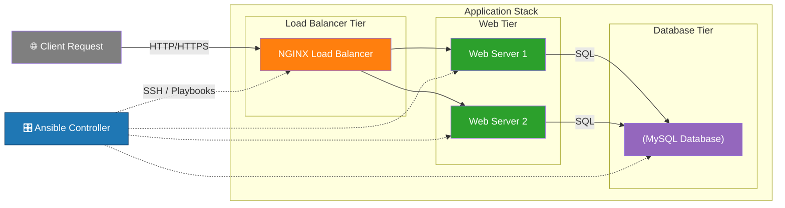

# 🚀 Ansible Lab – Infrastructure Automation with Docker (3-Tier Architecture)

## 📖  Executive Summary
This project demonstrates how **Infrastructure as Code (IaC)** and **configuration automation** can be used to provision and manage a complete **3-tier application stack** (Load Balancer, Web Servers, and Database) using Ansible and Docker.


### 👉 Business Value:
- Eliminates manual server configuration
- Enables repeatable and consistent deployments
- Reduces time-to-deploy and operational errors
- Simulates real-world production automation workflows

---

## 🏗️ Architecture Diagram



## 📐 Infrastructure Design 

The lab environment consists of four Ubuntu-based containers, each operating as a lightweight virtual machine within an isolated containerized infrastructure. Two containers are configured as web servers, while the remaining containers provide MySQL database and load-balancing services. The host machine will be acting as Ansible controller. 

Ubuntu container images were intentionally selected instead of prebuilt MySQL or Nginx images to demonstrate infrastructure configuration and service deployment through Ansible automation. This approach highlights configuration management, software provisioning, and orchestration practices commonly used in cloud and DevOps environments, rather than relying on vendor-preconfigured application containers.

Containers were chosen to reduce system resource consumption, improve deployment speed, and enable rapid environment provisioning and teardown. The overall objective of this lab is to provide a practical demonstration of Ansible automation workflows and infrastructure-as-code concepts, rather than to build a production-grade application platform.

## 🔁 Workflow (Automation Pipeline)
```
Code Repository
    ↓
Provision Docker Containers
    ↓
Ansible Controller
    ↓
Initialize MySQL Database
    ↓
Deploy Web Servers
    ↓
Configure NGINX (Load Balancer)
    ↓
Validate End-to-End Connectivity

```
## 🧰 Tech Stack

This project demonstrates hands-on experience with modern DevOps tooling and infrastructure automation practices.

### Core Technologies
- **Ansible** – Configuration management, orchestration, idempotent automation
- **Docker** – Containerized infrastructure for reproducible lab environments
- **Docker Compose** – Multi-container orchestration and service definition
- **NGINX** – Load balancing and reverse proxy configuration
- **MySQL** – Database provisioning and service automation

### DevOps & Engineering Concepts
- Infrastructure as Code (IaC)
- Configuration Management
- Multi-tier application architecture
- Agentless automation (SSH-based Ansible)
- YAML-based declarative configuration
- Role-based automation design
- Repeatable and version-controlled environments

## ⚙️ Key Features / Capabilities

- ✅ Fully automated provisioning of a 3-tier architecture
- ✅ End-to-end infrastructure configuration using Ansible playbooks
- ✅ Load-balanced web tier using NGINX
- ✅ Scalable web layer with multiple servers
- ✅ Database layer automation (MySQL setup and configuration)
- ✅ Container-based lab environment for portability and isolation
- ✅ Idempotent execution ensures consistent system states
- ✅ Separation of infrastructure (Docker) and configuration (Ansible)
- ✅ Realistic simulation of production-style deployment workflows

## 🧩 Detailed Explanation Of The Project Components 

### 📦 Container Creation
All required infrastructure is provisioned using Docker.

Only one Dockerfile is included and it is the base image for each container.

The docker-compose.yml creates four containers from the Dockerfile, assigns static IP addresses, and creates the Docker network "ansible-net" with the CIDR block 10.10.10.0/24.

### 👷‍♂️ Roles 
Four Ansible roles are included in this project, located in the roles directory.

**mysql_db role**
- Installs MySQL, configures the database server, and inserts a sample record.
- Tasks: roles/mysql_db/tasks

**webserver role**
- Configures the web servers, and seeds the flask app. 
- Tasks: roles/webserver/tasks
- Flask application files: roles/webserver/files

**python role**
- Installs Python dependencies for both the web and database containers.
- Tasks: roles/python/tasks

**lb role**
- Installs NGINX and configures it as a load balancer.
- Tasks: roles/lb/tasks
- NGINX template: roles/lb/templates

### 🗃️ The inventory file
To simplify the lab, a static inventory file was chosen for implementation. The static IP address are assigned to containers and admin user is created during container creation. The Ansible credentials will be passed in the group_vars variables.  

#### 🔡 Ansible Credentials
- The ansible controller(host machine) will use user name and a private key to connect to the containers. The public key will be baked into the container image, so ssh key pair generation is required before the container creation step. Please view detials steps in "How to run this lab" section below.

### 📕 The playbook
The main playbook will execute the followings in order
- deploy a MySQL server
- deploy two flask web app servers
- deploy a nginx load balancer 
- send an email notification about deployment status


## 🎯 What I Learned / Demonstrated

This project reflects practical DevOps engineering skills beyond theoretical knowledge:

### Technical Skills
- Designing and implementing a multi-tier architecture
- Writing idempotent Ansible playbooks
- Managing infrastructure using declarative automation
- Debugging service configurations (NGINX, MySQL)
- Working with containerized environments

### DevOps Practices
- Infrastructure as Code (IaC)
- Configuration management at scale
- Automation-driven deployments
- Reproducible environments

### Problem-Solving Ability
- Simulating production-like systems locally
- Abstracting infrastructure complexity using Docker
- Automating repetitive configuration tasks

# 🔄 Future Improvements

To further enhance this project and demonstrate advanced DevOps capabilities:

- 🚀 Integrate CI/CD pipeline using GitHub Actions
- ☸️ Extend architecture to Kubernetes-based deployment
- 📊 Add monitoring and observability (Prometheus + Grafana)
- 🔐 Implement secrets management (Ansible Vault / HashiCorp Vault)
- 🧪 Add automated testing for playbooks (Molecule)
- ☁️ Deploy to cloud infrastructure (AWS / Azure / GCP)
- 📦 Introduce dynamic inventory (cloud-based or templated)

---

# ☝️ How To Run This Lab 🔬
Runnning this lab on local system is recommended. It should also work on virtual machines or GitHub Codespace. 

## ✅ Prerequisites
Before running this lab, ensure the following tools are installed on your system:

- **Docker** (version 20+ recommended)
- **Docker Compose** (v2+)
- **Ansible** (version 2.10+)
- **Git** (optional, for cloning the repository)
- **Python 3** (for Ansible and local tooling)
- **Email App Password** (to receive a notification once Ansible completes all tasks)

You can verify installation with:
```
docker --version
docker compose version
ansible --version 
```
### 📌 Email notification (Optional)
Email notificaion play is included in the playbook to notify you wheather playbook is failed or successed. If you like to receive an email notification, please include the App Password of your email in all.yml file inside of group_vars folder. If you haven't set up your App Passowrd then, you can get the App Password from your email provider. As an example, below is the link to setup your gmail App Password. 
 
```
https://myaccount.google.com/apppasswords 
```
You should be able to run the playbook without including your SMTP info and the App Password. 

## 📁 Directory Structure
Below is the recommended structure of this project: 
```
ansible-lab/
├── docker-compose.yml       # Infrastructure definition
├── Dockerfile              
├── inventory.txt            # Defined managed nodes and groups
├── playbook.yml             # Automation logic (tasks & workflows)
├── group_vars/              # Centralized variable management
│   └── all.yml              
├── keys                     # SSH keys are used by Ansible to connect to the containers
|   └── ansbile_key          
|   └── ansible_key.pub       
├── roles/                   # Modular, reusable configurations
│   ├── mysql_db/            
│   │   └── tasks/
│   │       └── main.yml    
│   ├── webserver/
│   │   ├── tasks/
│   │   │   └── main.yml
│   │   └── files/
│   │       └── app.py
│   ├── python/
│   │   └── tasks/
│   │       └── main.yml
│   └── lb/
│       ├── tasks/
│       │   └── main.yml
│       └── templates/        # dynamic configuration files (Jinja2)
│           └── nginx.conf.j2
└── README.md                 # Project documentation
```

## Lab Instructions.
- Follow the instructions below

### 1. pull the repository <br />
Example:  
```
git init
git remote add origin https://github.com/phyomauk/ansible-lab.git
git pull origin main
```

### 2. Once repository is downloaded, generate a ssh key pair in "keys" folder<br />
Example: 
```
cd keys
ssh-keygen -t ed25519 -C "your_email@example.com"
chmod 600 your_private_key your_public_key.pub
```
Explanation: Public key will be baked into image during container creation and Ansbile will use a private key to connect to containers. 

### 3. Copy below variable values and paste it in all.yml file inside of group_vars folder, and update only the smtp variable values with your smtp values<br />
Variables:
```
ansible_user: ansible
ansible_ssh_private_key_file: "{{ playbook_dir }}/keys/ansible_key"
ansible_ssh_common_args: "-o StrictHostKeyChecking=no"

db_admin_user: ansible
db_admin_password: ansible

db_name: employee_db
db_user: db_user
db_password: Passw0rd

# example and optional
smtp_host: "smtp.gmail.com"
smtp_port: 587
smtp_user: "your_name@gmail.com"
smtp_pass: "app password"
smtp_receiver: "your_name@gmail.com"
```

### 4. Start the containers 
```
docker compose up -d
```
This create all required containers

### 5. Run the Ansible playbook
```
ansible-playbook -i inventory.txt playbook.yaml
``` 
Ansible will configure the web servers, the database, and the load balancer on their respective containers.  

### 6. Testing the App
Once the app is up and running, verify that the Flask web app is responding and able to query the database.

1. Open your browser and navigate to:<br />

```
localhost:8080
```
The expected output should be:
“Welcome! Response from node01” or “Welcome! Response from node02”.
Refresh the browser repeatedly to validate that traffic is being distributed across both nodes (node01 and node02), demonstrating load balancing behavior.

---

2. Optional test 
```
localhost:8080/how are you
```
The response: I am good, how about you? Response from node01/node02

---

3. Test the conntion between the web and database layers
```
localhost:8080/employees
```
The expected output should be:</br> {"data":[{"id":1,"name":"Alice","position":"Engineer","salary":90000}],"served_by":"node01"} or  {"data":[{"id":1,"name":"Alice","position":"Engineer","salary":90000}],"served_by":"node02"}

---

### Removing Containers
When finsished, remove the containers: 
```
docker compose down
``` 

#### 📌 Note 
If the database container is stopped and restarted, the MySQL service must be started manually inside of the database container. There is no auto-start mechanism implemented for the MySQL service. The following command is the way to start the MySQL service.   
```
mysqld_safe &
```
---

Thank you for visting to my repo.<br /> 
Author: Phyo Mauk<br />
Year: 2026

